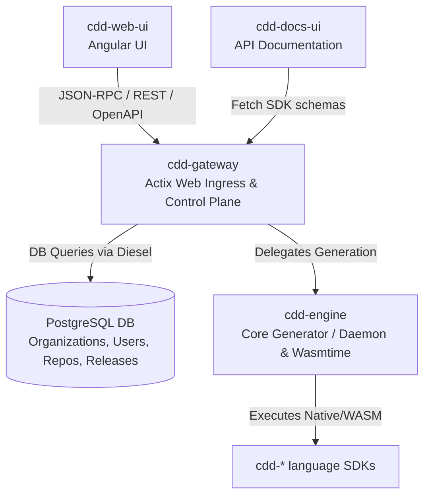

# cdd-gateway Architecture

> This document details the internal technical architecture, database models, and proxy capabilities of `cdd-gateway`. 

`cdd-gateway` serves as the unified ingress, reverse proxy, and control plane backend for the multi-language `cdd-*` toolchain. Built natively in Rust using `actix-web`, it provides a highly concurrent, reliable foundation for authentication, database synchronization, and API routing. 

It acts as the primary backend and Control Plane for the [`cdd-web-ui`](https://github.com/SamuelMarks/cdd-web-ui) graphical interface. While `cdd-web-ui` can operate fully offline via client-side WASM execution, `cdd-gateway` is utilized when users configure the UI to run in connected modes (e.g., syncing data, authenticating users, or offloading code generation to remote runners).

It operates primarily across two distinct local layers while delegating execution to the `cdd-engine` backend:

1. **The Control Plane API & Proxy (Actix Web)** - Exposing REST endpoints, managing RBAC, and proxying unmatched routes.
2. **The Database & ORM (PostgreSQL & Diesel)** - Managing state for users, orgs, and repository metadata.

## High-Level Diagram

## Core Subsystems

### 1. The REST API Gateway & Control Plane (`src/api/`)

Built upon `actix-web`, this component serves as a secure, OpenAPI-compliant backend.

- **Routing & Sync:** Provides endpoints for managing Organizations, Users, Repositories (SDKs), and Releases. Manages webhook integrations and payload handling directly with GitHub (`src/api/github.rs`).
- **Authentication:** Enforces JWT `Bearer` token auth (`src/api/auth_middleware.rs`). Issues tokens via an OAuth2 password grant flow hashed via **Argon2** and supports GitHub OAuth login stubs.
- **Reverse Proxy:** Unmatched routes are securely forwarded via the `proxy_handler` (`src/proxy.rs`), allowing this gateway to sit in front of underlying worker nodes or the `cdd-engine` core generator without exposing them directly.
- **OpenAPI / Swagger:** Utilizes `utoipa` to generate live OpenAPI 3.x specifications automatically from the Rust codebase. A live sandbox is exposed at `/swagger-ui/`.

### 2. Database & Data Models (`src/db/`)

The database layer uses `diesel` (an asynchronous-friendly ORM in Rust) wrapping an `r2d2` PostgreSQL connection pool.

- **Entities:** Manages the relational mapping of `Users`, `Organizations`, `Repositories`, and `Releases`.
- **RBAC (Role-Based Access Control):** Uses many-to-many link tables (e.g., `organization_users`) storing explicit string-based roles (like `"owner"`, `"member"`) to securely gate access to mutation APIs.
- **Abstract Repository Pattern:** To ensure 100% test coverage and dependency inversion, `CddRepository` provides an async trait abstraction, allowing the business logic to be tested against a `mockall` mock repository without requiring a live database connection.

### 3. Execution Delegation (`cdd-engine`)

`cdd-gateway` itself does *not* manage daemon processes or WASM execution directly. Instead, it relies on the upstream `cdd-engine` crate (and corresponding standalone JSON-RPC daemon services like `cdd-rpc` or `cdd-rpc-wasm`) to perform the heavy lifting of AST parsing and WASM execution. The gateway acts as the secure middleman, authenticating the `cdd-web-ui` requests before proxying the generation workloads down to the engine layer.

### 4. Client-Side WASM Integration (`cdd-gateway-wasm-sdk/`)

While the gateway serves as the cloud backend, `cdd-gateway-wasm-sdk/` provides the bridge for `@bjorn3/browser_wasi_shim` enabling the `cdd-web-ui` to bypass the cloud backend entirely and execute generation securely within the browser sandbox when configured for Offline Mode.

## Configuration

Configurations are handled elegantly via the `config` crate, resolving environment variable overrides (like `CDD__SERVER_BIND`) or falling back to defaults.
