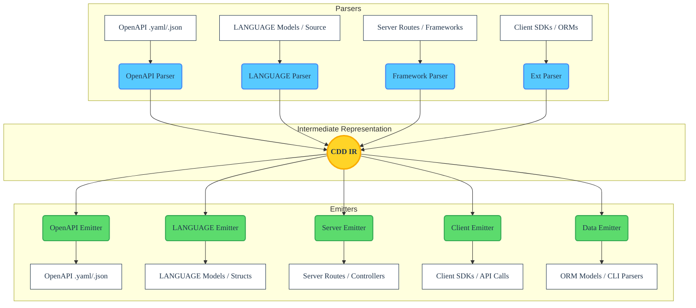

You are an expert technical documentation writer. I am building a suite of bidirectional compilers (named `cdd-*`) that convert between OpenAPI specifications and native code (models, routes, ORMs, clients) using AST/static analysis.

I need you to generate a `README.md` and an `ARCHITECTURE.md` for one of these repositories based on the specifics provided below.

Here is the context for the current repository:
- **Repository Name**: {REPO_NAME} (e.g., cdd-python, cdd-rust, cdd-kotlin)
- **Language**: {LANGUAGE} (e.g., Python, Rust, Kotlin)
- **File Extension**: {LANGUAGE_EXTENSION} (e.g., py, rs, kt)
- **CLI Command**: {CLI_COMMAND} (e.g., python -m cdd, cdd-rs, gradle run)
- **Project Scope**: {PROJECT_SCOPE} (e.g., Client-only, Server-only, Bidirectional)
- **Prerequisites & Installation**: {INSTALL_INSTRUCTIONS} (e.g., "Requires Python 3.8+. Run `pip install cdd-python`" or "Requires Rust toolchain. Run `cargo build --release`")
- **Supported Conversions**: {SUPPORTED_CONVERSIONS} (e.g., Parse OpenAPI, Emit Pydantic models, Emit FastAPI routes)

Please use the following templates to generate the exact file contents. Make sure to:
1. Replace all `{PLACEHOLDER}` values.
2. Fill out the **Installation** and **Usage** sections with idiomatic instructions and code snippets based on the provided context.
3. Check the appropriate boxes (`✅`) in the Supported Conversions table based on the provided capabilities.
4. Omit or adjust architecture sections if the repository is specifically client-only or server-only.

---

### === BEGIN TEMPLATE FOR README.md ===

cdd-LANGUAGE
============

<!-- REPLACE WITH separate test and doc coverage badges that you generate in pre-commit hook -->

OpenAPI ↔ {LANGUAGE}. This is one compiler in a suite, all focussed on the same task: Compiler Driven Development (CDD).

Each compiler is written in its target language, is whitespace and comment sensitive, and has both an SDK and CLI.

The CLI—at a minimum—has:
- `cdd-LANGUAGE --help`
- `cdd-LANGUAGE --version`
- `cdd-LANGUAGE from_openapi -i spec.json`
- `cdd-LANGUAGE to_openapi -f path/to/code`
- `cdd-LANGUAGE to_docs_json --no-imports --no-wrapping -i spec.json`

The goal of this project is to enable rapid application development without tradeoffs. Tradeoffs of Protocol Buffers / Thrift etc. are an untouchable "generated" directory and package, compile-time and/or runtime overhead. Tradeoffs of Java or JavaScript for everything are: overhead in hardware access, offline mode, ML inefficiency, and more. And neither of these alterantive approaches are truly integrated into your target system, test frameworks, and bigger abstractions you build in your app. Tradeoffs in CDD are code duplication (but CDD handles the synchronisation for you).

## 🚀 Capabilities

The `{REPO_NAME}` compiler leverages a unified architecture to support various facets of API and code lifecycle management.

* **Compilation**:
  * **OpenAPI → `{LANGUAGE}`**: Generate idiomatic native models, network routes, client SDKs, database schemas, and boilerplate directly from OpenAPI (`.json` / `.yaml`) specifications.
  * **`{LANGUAGE}` → OpenAPI**: Statically parse existing `{LANGUAGE}` source code and emit compliant OpenAPI specifications.
* **AST-Driven & Safe**: Employs static analysis (Abstract Syntax Trees) instead of unsafe dynamic execution or reflection, allowing it to safely parse and emit code even for incomplete or un-compilable project states.
* **Seamless Sync**: Keep your docs, tests, database, clients, and routing in perfect harmony. Update your code, and generate the docs; or update the docs, and generate the code.

## 📦 Installation

<!-- INSTRUCTION TO LLM: Insert specific installation instructions, package managers, and prerequisites here based on the `{INSTALL_INSTRUCTIONS}` context. -->

## 🛠 Usage

### Command Line Interface

<!-- INSTRUCTION TO LLM: Provide 1-2 idiomatic CLI examples using the `{CLI_COMMAND}` placeholder. Ensure paths reflect standard `{LANGUAGE}` project structures. -->

### Programmatic SDK / Library

<!-- INSTRUCTION TO LLM: Provide a small code snippet in `{LANGUAGE}` demonstrating how to invoke the compiler as a library, using the `{LANGUAGE_EXTENSION}`. -->

## Design choices

<!-- INSTRUCTION TO LLM: Provide a defense of the design choices made here, e.g., why parser library was used, why system library was used, etc. ; and what fancy features are found here that may not be in other cdd-* projects. -->

## 🏗 Supported Conversions for {LANGUAGE}

*(The boxes below reflect the features supported by this specific `{REPO_NAME}` implementation)*

| Concept | Parse (From) | Emit (To) |
|---------|--------------|-----------|
| OpenAPI (JSON/YAML) | [ ] | [ ] |
| `{LANGUAGE}` Models / Structs / Types | [ ] | [ ] |
| `{LANGUAGE}` Server Routes / Endpoints | [ ] | [ ] |
| `{LANGUAGE}` API Clients / SDKs | [ ] | [ ] |
| `{LANGUAGE}` ORM / DB Schemas | [ ] | [ ] |
| `{LANGUAGE}` CLI Argument Parsers | [ ] | [ ] |
| `{LANGUAGE}` Docstrings / Comments | [ ] | [ ] |

<!-- INSTRUCTION TO LLM: Check the boxes above (`✅`) based on the `{SUPPORTED_CONVERSIONS}` context provided. -->

---

## License

Licensed under either of

- Apache License, Version 2.0 ([LICENSE-APACHE](LICENSE-APACHE) or <https://www.apache.org/licenses/LICENSE-2.0>)
- MIT license ([LICENSE-MIT](LICENSE-MIT) or <https://opensource.org/licenses/MIT>)

at your option.

### Contribution

Unless you explicitly state otherwise, any contribution intentionally submitted
for inclusion in the work by you, as defined in the Apache-2.0 license, shall be
dual licensed as above, without any additional terms or conditions.

### === END TEMPLATE FOR README.md ===

---

### === BEGIN TEMPLATE FOR ARCHITECTURE.md ===

# {REPO_NAME} Architecture

<!-- BADGES_START -->
<!-- Replace these placeholders with your repository-specific badges -->

<!-- BADGES_END -->

The **{REPO_NAME}** tool acts as a dedicated compiler and transpiler. Its fundamental architecture follows standard compiler design principles, divided into three distinct phases: **Frontend (Parsing)**, **Intermediate Representation (IR)**, and **Backend (Emitting)**.

This decoupled design ensures that any format capable of being parsed into the IR can subsequently be emitted into any supported output format, whether that is a server-side route, a client-side SDK, a database ORM, or an OpenAPI specification.

## 🏗 High-Level Overview

<!-- INSTRUCTION TO LLM: If this specific repo is explicitly Client-only or Server-only based on the `{PROJECT_SCOPE}`, gracefully adjust the descriptions below to emphasize its specific role. -->

## 🧩 Core Components

### 1. The Frontend (Parsers)

The Frontend's responsibility is to read an input source and translate it into the universal CDD Intermediate Representation (IR).

* **Static Analysis (AST-Driven)**: For `{LANGUAGE}` source code, the tool **does not** use dynamic reflection or execute the code. Instead, it reads the source files, generates an Abstract Syntax Tree (AST), and navigates the tree to extract classes, structs, functions, type signatures, API client definitions, server routes, and docstrings.
* **OpenAPI Parsing**: For OpenAPI and JSON Schema inputs, the parser normalizes the structure, resolving internal `$ref`s and extracting properties, endpoints (client or server perspectives), and metadata into the IR.

### 2. Intermediate Representation (IR)

The Intermediate Representation is the crucial "glue" of the architecture. It is a normalized, language-agnostic data structure that represents concepts like:
* **Models**: Entities containing typed properties, required fields, defaults, and descriptions.
* **Endpoints / Operations**: HTTP verbs, paths, path/query/body parameters, and responses. In the IR, an operation is an abstract concept that can represent *either* a Server Route receiving a request *or* an API Client dispatching a request.
* **Metadata**: Tooling hints, docstrings, and validations.

By standardizing on a single IR (heavily inspired by OpenAPI / JSON Schema primitives), the system guarantees that parsing logic and emitting logic remain completely decoupled.

### 3. The Backend (Emitters)

The Backend's responsibility is to take the universal IR and generate valid target output. Emitters can be written to support various environments (e.g., Client vs Server, Web vs CLI).

* **Code Generation**: Emitters iterate over the IR and generate idiomatic `{LANGUAGE}` source code. 
  * A **Server Emitter** creates routing controllers and request-validation logic.
  * A **Client Emitter** creates API wrappers, fetch functions, and response-parsing logic.
* **Database & CLI Generation**: Emitters can also target ORM models or command-line parsers by mapping IR properties to database columns or CLI arguments.
* **Specification Generation**: Emitters translating back to OpenAPI serialize the IR into standard OpenAPI 3.x JSON or YAML, rigorously formatting descriptions, type constraints, and endpoint schemas based on what was parsed from the source code.

## 🔄 Extensibility

Because of the IR-centric design, adding support for a new `{LANGUAGE}` framework (e.g., a new Client library, Web framework, or ORM) requires minimal effort:
1. **To support parsing a new framework**: Write a parser that converts the framework's AST/DSL into the CDD IR. Once written, the framework can automatically be exported to OpenAPI, Client SDKs, CLI parsers, or any other existing output target.
2. **To support emitting a new framework**: Write an emitter that converts the CDD IR into the framework's DSL/AST. Once written, the framework can automatically be generated from OpenAPI or any other supported input.

## 🛡 Design Principles

1. **A Single Source of Truth**: Developers should be able to maintain their definitions in whichever format is most ergonomic for their team (OpenAPI files, Native Code, Client libraries, ORM models) and generate the rest.
2. **Zero-Execution Parsing**: Ensure security and resilience by strictly statically analyzing inputs. The compiler must never need to run the target code to understand its structure.
3. **Lossless Conversion**: Maximize the retention of metadata (e.g., type annotations, docstrings, default values, validators) during the transition `Source -> IR -> Target`.
4. **Symmetric Operations**: An Endpoint in the IR holds all the information necessary to generate both the Server-side controller that fulfills it, and the Client-side SDK method that calls it.

### === END TEMPLATE FOR ARCHITECTURE.md ===
